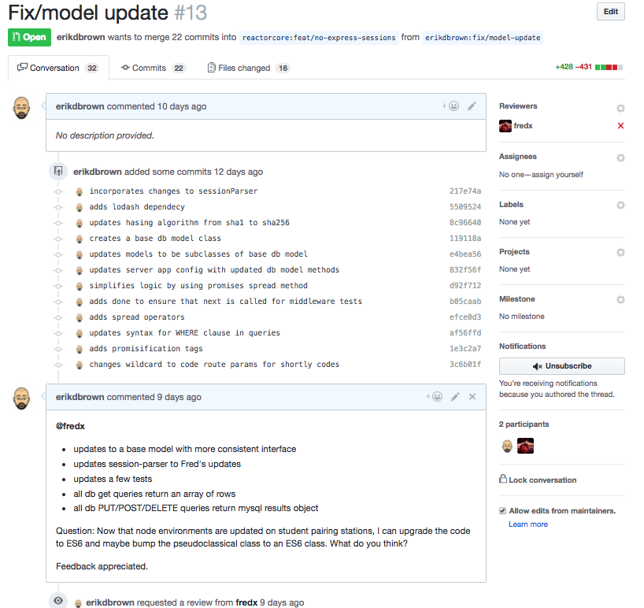
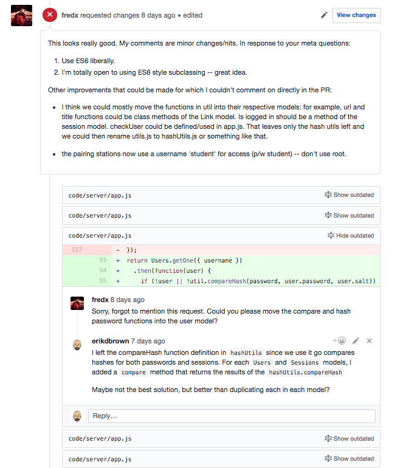
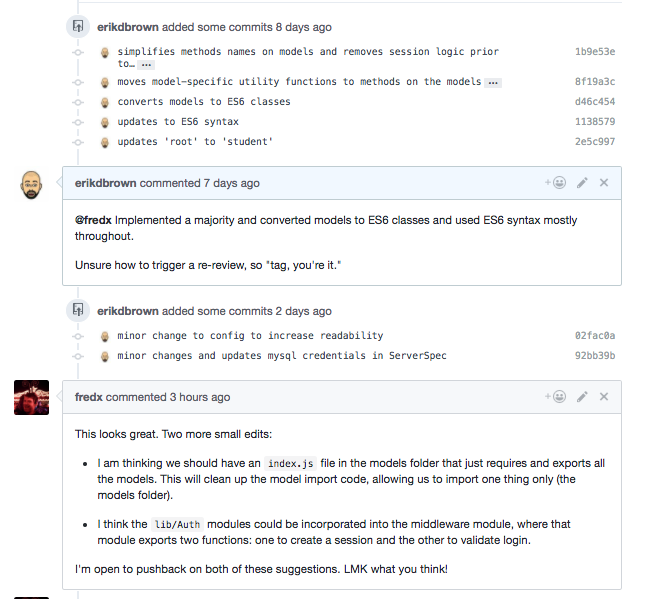
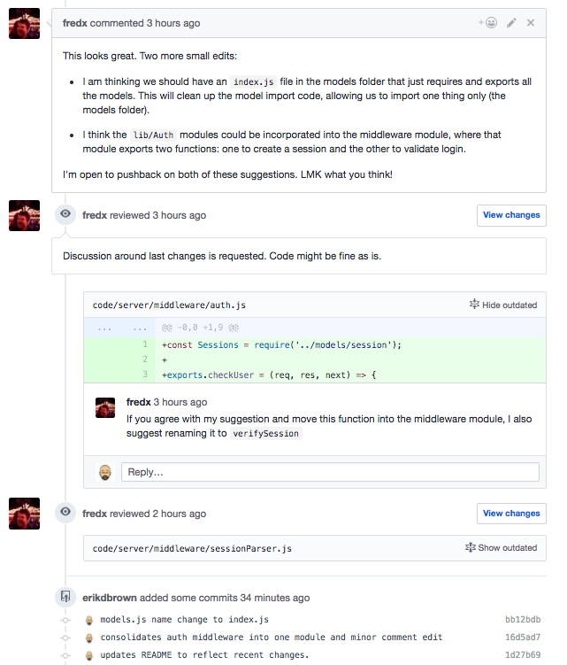

# [Reading] Code review checklist

To get a sense for what we're talking about, let's just jump right into a code review checklist. You can skim this every time you perform a review.

###  Phase 1: The light pass

In this first pass of a code diff, look for the following:

* Typos
* Poor names for variables, functions, classes, etc
* Overly-large functions or classes
* At least one test. Tests are mandatory -- send back the PR if it doesn't come with tests.
* The tests pass.
* Cruft: commented-out code that should be deleted.
* Violations of our styleguide that linters didn’t catch yet.

### Phase 2: The deep, contextual pass

* If after taking the time to read whatever the PR links to, the reviewer can't actually understand what the code is doing, send it back for clarification.
* Feature spec omissions. “Shouldn’t this component also do X?”
* Adequate test coverage for changed lines or critical code paths.
* Tests assert valuable behaviors.
* There are negative tests, not just happy-path tests.
* Tests assert the interfaces of the components involved (their API's) -- NOT  reaching into the internals to test implementation details.
* Propose alternative implementations or refactoring that will increase readability, maintainability, extensibility
  * Proposals for making functions do only one thing.
  * Proposals for removing side effects from functions.
  * Proposals for factoring out helper functions or otherwise modularizing to make crisper "Lego blocks" to build the solution with.
* Unhandled edge-cases based on assumptions that a component has about its data
* Ways to reduce the number of things that a single component, especially a function, is doing.

## The importance of code reviews

If you don't make time to review each other's code, you are (a) setting the stage for a poorly-constructed system, (b) not preparing yourself to work in industry.

Every good development team allocates substantial time for code review, just as they allocate time to write tests.

Not doing these things is just sloppy and unprofessional, and asking for a steaming pile of crapola. Don't be that kind of developer. Aim to be a thoughtful, collaborative _engineer_... not a shrieking simian flinging poo through the cage bars because of perceived deadline pressure :p

### Enlightened self-interest reason #1

You are preparing yourself to be a productive member of the team you are going to join some weeks from now.  Don't shortchange your own learning experience by cutting this corner.

## Do your code reviews in writing

Please do not live-pair on code reviews -- do them async, in writing.

Of course, occasional pairing on development itself is fine, but don't do the reviews as in-person walk-throughs. It means an important part of your overall team contribution goes invisibly into the ether.

### Enlightened self-interest reason #2

The groundwork of your careful analysis in a good code review makes it easier for Tech Mentors and other HR staff to jump in with extra guidance. That guidance can be very useful to all parties.

This presupposes that you are doing your code reviews in writing.

### Enlightened self-interest reason #3

By doing your review work in writing, it is possible for potential employers to examine your code reviews among your work artifacts, and see clear evidence of well-rounded contributions to a development team.

Thoughtful code reviews are a compelling artifact. Writing your own code is obviously very important too, but don't downplay the value of the rest of the work artifacts.

## Good code reviews take time

### What does it mean to "read code"?

To really read code, you need to understand a lot of things beyond what is simply syntactically happening in each line of code.

#### Backstory / context to this pull request

What is the problem domain in this area of the codebase? What user-facing problems are we solving here?  What is the exact feature specification that we are building against, including both textual and graphical aids (e.g., wireframes)?

#### Components and flow

* What is the _user-facing_ flow of this work?
* What is the _under-the-hood_ system flow of this work?
  * Which files are involved?
  * Which components are involved?
  * How do they tie together?
  * What are the contracts between them?
* What is the entry point for understanding this pull request? Where do I even start reading?

#### Visualizing running state

The written code is just a static recipe. Naturally, the system only comes alive and starts performing useful work after the code starts executing.

The relevant code is hardly ever only running in a single process. For a web app, there'll be the browser process on the client machine, and at least one server process on a server machine.  There are likely to be other processes involved as well -- a database process on some machine, either the server machine or a dedicated database machine. There are often other services, including 3rd-party stuff, in the mix as well.

Messages are flowing throughout all these processes in a dynamic dance. Can the code reader keep sufficient track of what's going to happen when the code in this pull request executes?

As the code executes, what is the initial state? The desired output state? What transforms the system from the former to the latter? What are the intermediate states, as processing occurs?

Sufficient visualization of the above is NON-TRIVIAL but CRITICAL.

#### You can't skimp and still do a real review

Which of the above aspects do you think you can hand-wave?

If the code reader can't understand the above, the resulting code review probably isn't going to really help anybody.

#### Avoid low-value syntax-only code reviews

The lowest-value code reviews are no-op rubber-stamps. Close behind are syntax-only code reviews, where the code reviews acts as a human linter.

The whole team should set up linting, no exceptions.

E.g., for Sublime Text:

* SublimeLinter
* SublimeLinter-eslint

## Some logical follow-on observations about pull requests

### PR's need to be small

You can see why keeping changes small is important. Beyond a couple hundred lines, PR's rapidly become monsters that take multiple hours to understand.

### PR's need to provide context about themselves

A PR that just has a title is usually not enough context.

For example, without a link to a user story or _something_ explaining the feature context for your change, how is your reviewer going to know what you're even trying to accomplish?

### Example

Below is an example of a code review in which one of our technical mentors (Erik) was making updates to the shortly express sprint to remove express sessions from the scaffold repo. Here is the interaction he had with Fred:

You will notice that the first Pull Request comes with a very deliberate list of changes as well as poses a question for a reviewer.

The Reviewer (Fred) answers the Revewiee's (Erik) questions, adds inline comments for specific errors, as well as gives overarching suggestions for improvements. The Reviewee replies with his justification for why he has made the decision to not make the proposed refactor.

Erik follows up with the updates with most of the review suggestions and converted everything to ES6 syntax. Fred follows up with two more changes in terms of general cleanup of code by migrating parts of the auth to the middleware module and adding an index.js for cleaner model exporting.

Last inline comment by Fred giving suggestion to rename function to be more semantically accurate. And then this PR is ready to be merged.
