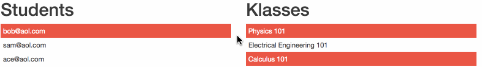

# Markdown Smoketest

# H1 Top-Level Heading
## H2 Next-Level Heading
### H3 Next-Level Heading
#### H4 Next-Level Heading
##### H5 Next-Level Heading
###### H6 Next-Level Heading

Paragraph Text. Before he joined the Galvanize Web Development Immersive Program, former US Army Sgt. Allen Fordham traveled the world in search of his passion. Growing up, Allen’s family moved a lot; he had lived in six…

### Word emphasis
Words can have *emphasis*, **strong emphasis**, or ~~strikethrough~~.

### OL
1. first
1. second
1. third

### UL
* ul one
* ul two
* ul three

### Links
* [relative link](target.md)
* [relative link, nested](folder-DO-NOT-DELETE/target.md)
* [absolute link](https://github.com/Galvanize-IT/learn-sandbox/blob/master/target.md)
* [folder link](folder-DO-NOT-DELETE/)
* [Galvanize.com external link](http://www.galvanize.com)
* [Github exercise repo](https://github.com/gSchool/galvanize-eats)
* [Github exercise repo, link to README/md](https://github.com/gSchool/galvanize-eats/blob/master/README.md)
* [js file](sample.js)
* [Google.com external link](http://google.com)
* [http://localhost:3002 internal link with host](http://localhost:3002)

### Images
Galvanize Logo


Animated GIF test


### Video
<iframe src="https://player.vimeo.com/video/214871308" width="640" height="360" frameborder="0" webkitallowfullscreen mozallowfullscreen allowfullscreen></iframe>

### Syntax Highlighting
Inline `code` has `back-ticks around` it.

```javascript
var s = "JavaScript syntax highlighting";
alert(s);
```

```python
s = "Python syntax highlighting"
print s
```

```
For data point in training set:
    calculate distance from data point to new_value
Order distances in increasing order and take the first k
Make the prediction

No language indicated, so no syntax highlighting.
But let's throw in a <b>tag</b>.
```

### Maths
$$x = {-b \pm \sqrt{b^2-4ac} \over 2a}.$$

### Blockquotes

> Blockquotes are very handy in email to emulate reply text.
> This line is part of the same quote.

Quote break.

> This is a very long line that will still be quoted properly when it wraps.


### Tables

| Tables        | Are           | Cool  |
| ------------- |---------------| ------|
| enterprise    | dsi           | wdi   |

### Instructor tags (nothing should show up after this line)

### !instructor

# H1

Text


[relative link](target.md)

Inline `code` has `back-ticks around` it.

$$x = {-b \pm \sqrt{b^2-4ac} \over 2a}.$$

> Blockquotes are very handy in email to emulate reply text.
> This line is part of the same quote.

### !end-instructor
